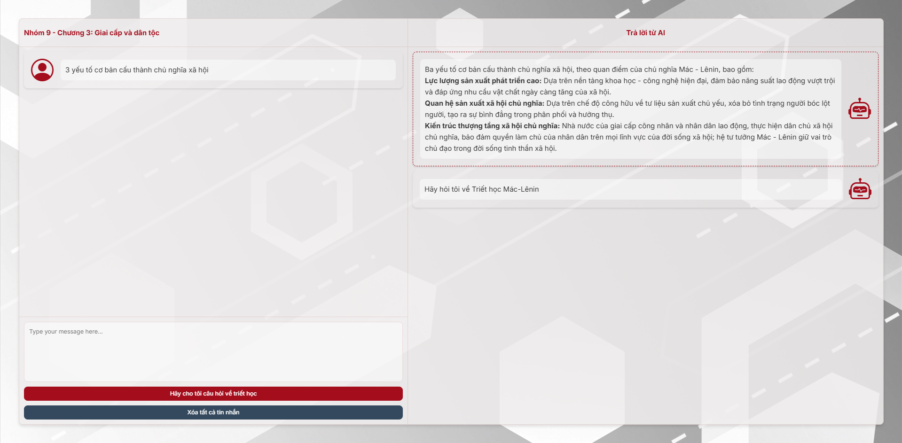
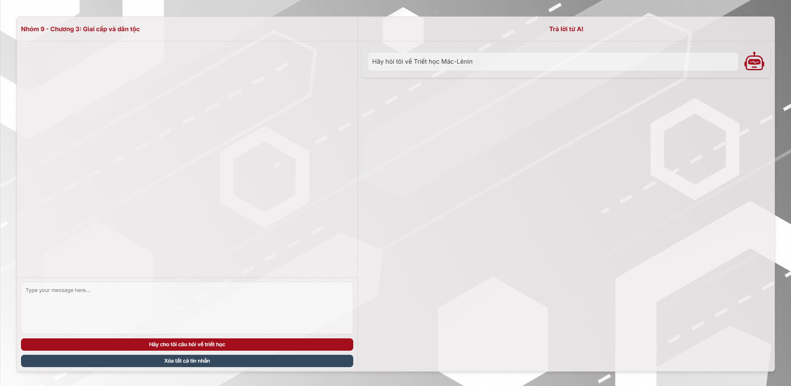
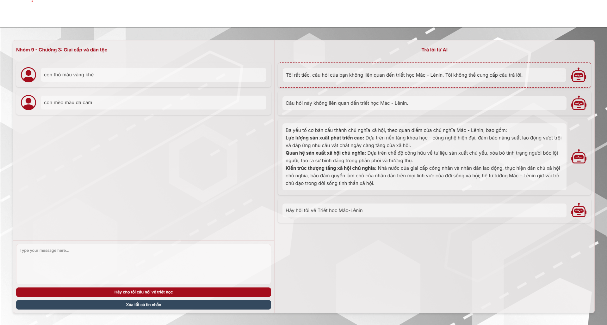

# Philosophy Chat Supporting Portal

 
 

 

## Table of Contents
<ol start="0"> 
    <li><a href="#intro">Introduction</a></li>
    <li><a href="#screen-flow">Screens</a></li>
</ol>

## 0. Introduction
Psychology Chat Supporting Portal is a chatbot powered by the Gemini API, created to help students explore and apply the principles of MacLenin philosophy in their everyday lives.

## 1. Target Users

- **Primary Users**:
    - Student

## 2. Screens

### 2.1. Correct Answer

### 2.2. Correct Answer

### 2.3. Correct Answer

